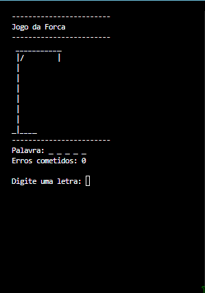

#  Jogo da Forca 2026!





## Introdução  
Um jogo de forca desenvolvido em console utilizando C#, onde o jogador deve adivinhar uma palavra secreta letra por letra. O jogo apresenta interação contínua, controle de erros e exibição gráfica da forca conforme o progresso da partida.


## Funcionalidades  

- **Seleção Aleatória de Palavra**: O jogo escolhe automaticamente uma palavra aleatória a partir de uma lista pré-definida.  

- **Entrada de Letras**: O jogador pode digitar letras para tentar adivinhar a palavra secreta.  

- **Controle de Acertos e Erros**:  
  - Letras corretas são reveladas na posição correta.  
  - Letras incorretas aumentam o contador de erros.  

- **Limite de Tentativas**: O jogador pode errar até 5 vezes. Após isso, o jogo é encerrado.  

- **Exibição da Forca**: A cada erro, o desenho da forca é atualizado visualmente no console.  

- **Verificação de Vitória ou Derrota**:  
  - Vitória ao acertar todas as letras da palavra.  
  - Derrota ao atingir o limite de erros.  

- **Reinício de Partida**: Ao final de cada jogo, o jogador pode escolher continuar ou encerrar.  


## Como funciona o programa  

O sistema é dividido em métodos que organizam a lógica do jogo:

- **ExibirCabecalho()**  
  Responsável por limpar a tela e mostrar o título do jogo junto com um desenho inicial da forca.

- **EscolherPalavraAleatoria()**  
  Seleciona uma palavra aleatória utilizando um gerador seguro (`RandomNumberGenerator`).

- **PreencherLetrasAcertadas()**  
  Cria um vetor de caracteres preenchido com `_`, representando as letras ainda não descobertas.

- **ExecutarTentativas()**  
  Controla toda a lógica do jogo:
  - Recebe a letra digitada pelo usuário  
  - Verifica se a letra existe na palavra  
  - Atualiza os acertos ou incrementa os erros  
  - Verifica se o jogador venceu ou perdeu  

- **DesenharForca()**  
  Exibe visualmente o estado da forca de acordo com a quantidade de erros.

- **JogadorDesejaContinuar()**  
  Pergunta ao usuário se deseja jogar novamente, controlando o loop principal do jogo.


 ## Como utilizar o programa
 
 1. Clone o repositório ou baixe o código comprimido em .zip.
 2. Abra o emulador de terminal e navegue até a pasta raiz.
 3. Utilize o 'comando' abaixo para restaurar as dependencias do projeto.

 ```
 dotnet restore
 ```

 4. Em seguida compile e execute o projeto com o comando:

 ```
 dotnet run --project CalculadoraConsoleApp
 ````
 ## Requisitos
 - .NET SDK 10.0

[forca2.gif]: ./docs/forca2.gif.
